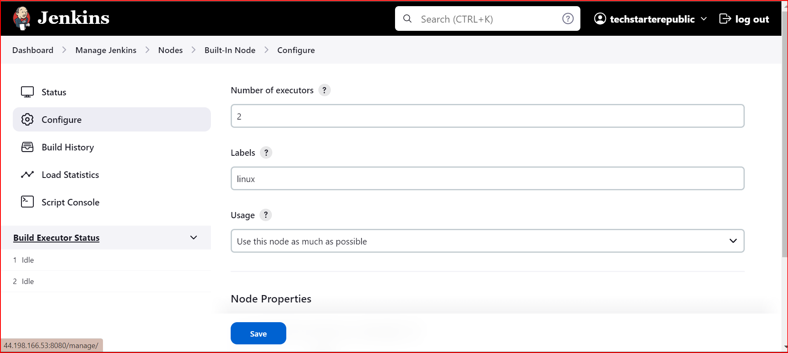
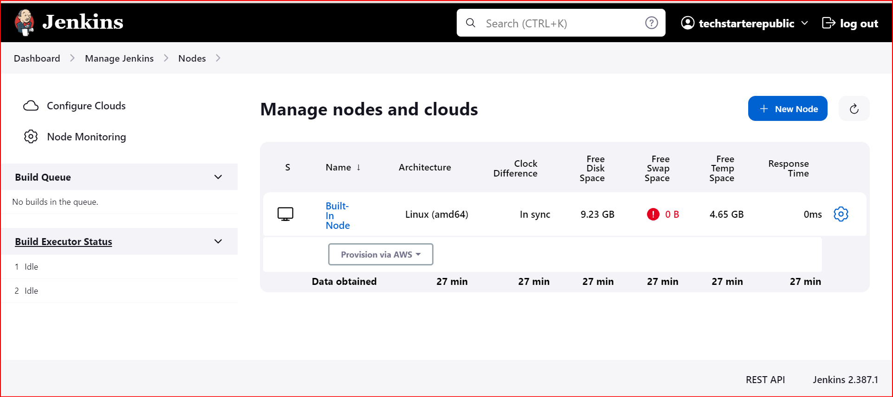

**BACKUP**

Backup is very important in any environment and this is because it contains imporant config files and directories.
we can use any programming lang. to achieve this, like in my case i'm using shell scripts to backup snapshots taking from the Jenkins EBS volume Snapshots.

# To run this job in crontab do this:

- RUN   `sudo crontab -e` this should open crontab GUI
- INSERT into crontab this schedue
    **0 0 * * 1,4 /path/to/ebs_backup.sh** 

You make changes to the schedule time but at the moment. 
This will run the backup script at midnight (0:00) every Monday and Thursday.

## Note:
The above script shoud be ran on the server or you can create a jenkins pipeline to constantly do this backup as a job.

# To run this job on Jenkins do this:

```
pipeline {
  agent any

  environment {
    AWS_REGION = 'us-east-1'
    VOLUME_ID = 'vol-1234567890abcdefg'
    RETENTION_DAYS = 30
  }

  triggers {
    cron('0 0 * * 1,4')
  }

  stages {
    stage('Backup') {
      steps {
        sh 'aws ec2 create-snapshot --region $AWS_REGION --volume-id $VOLUME_ID --description "EBS snapshot $(date +\'%Y-%m-%d %H:%M:%S\')"'
      }
    }

    stage('Cleanup') {
      steps {
        script {
          def oldSnapshots = sh(
            script: 'aws ec2 describe-snapshots --region $AWS_REGION --filters "Name=volume-id,Values=$VOLUME_ID" --query "Snapshots[?StartTime<=\\`$(date --date="-${RETENTION_DAYS} days" +%Y-%m-%d)\\`].SnapshotId" --output text',
            returnStdout: true
          ).trim()

          if (oldSnapshots) {
            sh "aws ec2 delete-snapshot --region $AWS_REGION --snapshot-id ${oldSnapshots.split()} || true"
          }
        }
      }
    }
  }
}
```

Install the `CloudBees AWS Credentials Plugin` plugins

This can be a Job on jenkins and it run to always trigger snapshots for the jenkins server and the EBS volumes.


## Jenkins self agent job
You can setup jenkins to run the server as an agent to run you pipeline jobs
```
pipeline {
    agent {
        label 'linux'
    }
    stages {
        stage('Echo String') {
            steps {
                sh """
                echo 'Hello, world!' \
                echo $HOME
            """
            }
        }
    }
}
```
 label you agent per requirement like `linux` etc as a lable to call in your scripts.
 

After adding the agent you can see in on your Jenkins server.



Jenkins trigger on free style job

`H/5 * * * *` would run every 5 mins top of the hours, every year, month and day.