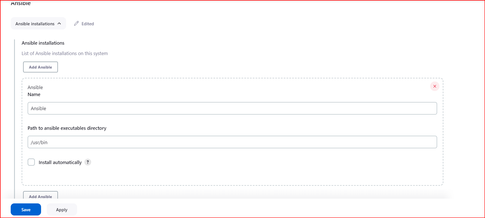
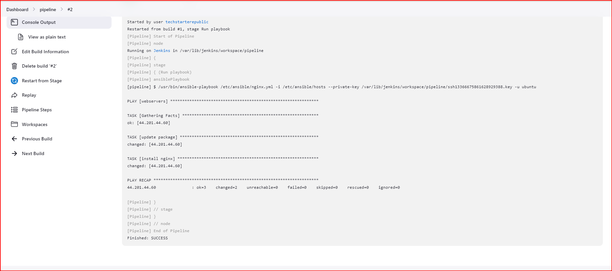

# Jenkins Integration with ansible

# STEP 1/4
- Install the **ansible plugin** on jenkins, go to **Manage Jenkins** click on available plugin and search for it.

# STEP 2/4
- Once plugin is install now you can setup the plugin in **Global tools configuration** in jenkins


# STEP 3/4
- Install ansible on the jenkins server. This step can be added to initial **userdata-script** used for Jenkins Installations.
- Make sure **ssh** is not restricted, should be open to the internet `0.0.0.0` this is because you don't control the agent on jenkins.

# STEP 4/4
- Ansible playbook should look like this below:

### Example - 1
```
pipeline{
    agent any
    stages{
        stage("Run playbook"){
            steps{
                ansiblePlaybook credentialsId: 'ubuntu-ssh', disableHostKeyChecking: true, installation: 'Ansible', inventory: '/etc/ansible/hosts', playbook: '/etc/ansible/nginx.yml'
            }
        }
    }
}
```

### Example - 2
```
pipeline{
    agent any
    environment{
        ANSIBLE_PRIVATE_KEY=credentials('ubuntu-ssh')
    }
    stages{
        stage("Run playbook"){
            steps{
                sh 'ansible-playbook -i /etc/ansible/webservers.host /etc/ansible/nginx.yml --private-key=$ANSIBLE_PRIVATE_KEY'
            }
        }
    }
}
```

# Successfully run should look like this:
